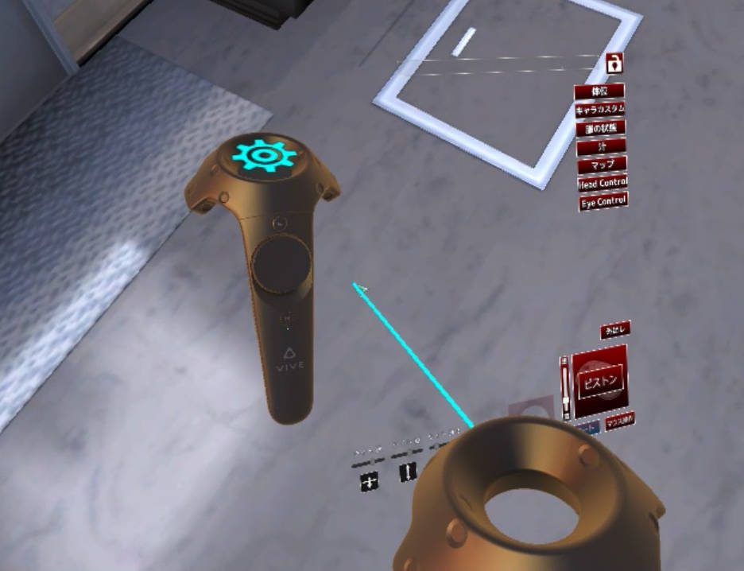
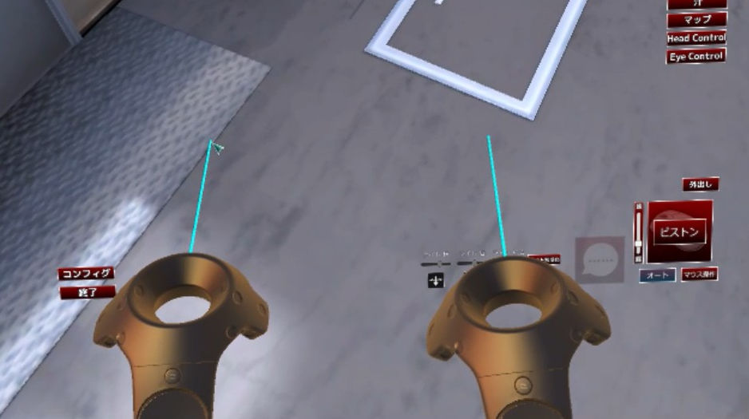
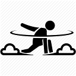
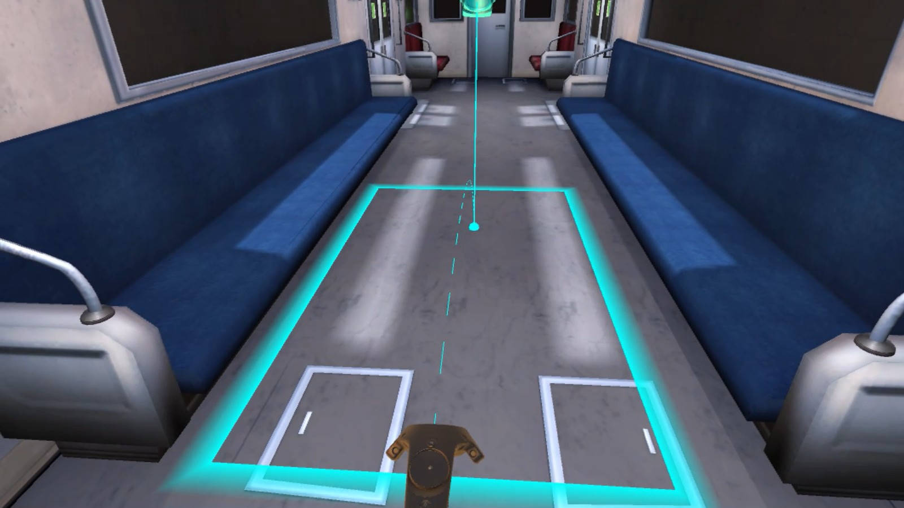
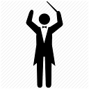
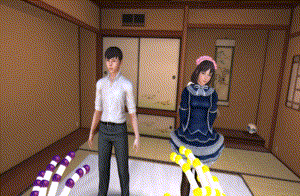
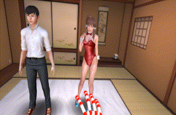

# PlayClubVR

This is a mod for Play Club that introduces VR capabilities for both the Vive and the Oculus Rift using OpenVR. It provides both a seated and a standing mode to be usable in any environment.


## Installation

1. Download [the latest release](https://github.com/Eusth/PlayClubVR/releases) and extract it into your *PlayClub* directory.
2. Run *PlayClubVR.exe* or *PlayClubStudioVR.exe*
3. Enjoy!

**Caution:** SteamVR needs to be installed, set up, and running! Rift users might otherwise experience a weird "monitor" effect.

## Modes & Controls

PlayClubVR comes in two *modes*:

| Mode        | Description         |
| ----------- | ------------------- |
| Seated      | *Default mode.* This mode lets you play the game with a mouse, keyboard, or gamepad.<br />The controls are essentially the same as in the main game. The screen is presented on a big monitor in front of you. |
| Standing    | As soon as tracked controllers are registered by the game, it switches into *standing mode*, also called *room scale mode*. In this mode, you can freely move around and use your Vive or Touch controllers to do cool stuff. |


### Seated Mode

As stated earlier, the controls are basically the same as in the main game with the exception of a few VR-related shortcuts. You are presented with a screen in front of your that replaces your monitor and can be configured via the settings or via shortcuts (see below).

#### Keyboard Shortcuts

Keys      | Effect
----      | ------
<kbd>Ctrl</kbd>+<kbd>C</kbd>, <kbd>Ctrl</kbd>+<kbd>C</kbd> | Change to *standing mode*.
<kbd>Ctrl</kbd>+<kbd>C</kbd>, <kbd>Ctrl</kbd>+<kbd>V</kbd> | Enable (very experimental) third person camera. [Was used for this video](https://www.youtube.com/watch?v=0klN6gd1ybM).
<kbd>Alt</kbd>+<kbd>S</kbd> | Save settings (IPD, screen position, etc.).
<kbd>Alt</kbd>+<kbd>L</kbd> | Load settings (last saved state).
<kbd>Ctrl</kbd>+<kbd>Alt</kbd>+<kbd>L</kbd> | Reset settings to the initial state.
<kbd>F4</kbd> | Switch GUI projection mode (flat, curved, spherical).
<kbd>F5</kbd> | Toggle camera lock (enabled by default). This prevents the camera to *tilt* because such movements are known to cause cyber sickness.
<kbd>Ctrl</kbd>+<kbd>F5</kbd> | Apply shaders (only for the brave)
<kbd>F12</kbd> | Recenter
<kbd>Ctrl</kbd>+<kbd>X</kbd> | Impersonate protagonist. Places the camera at the head position of the protagonist and moves along a little.
<kbd>Ctrl</kbd>+<kbd>Shift</kbd>+<kbd>X</kbd> | Impersonate protagonist. Places the camera at the head position of the protagonist and imitates *all* head movements.
<kbd>NumPad +</kbd> <br /> <kbd>NumPad –</kbd> | Move GUI up / down.
<kbd>Ctrl</kbd>+<kbd>Shift</kbd>+<kbd>NumPad +</kbd> <br /> <kbd>Ctrl</kbd>+<kbd>Shift</kbd>+<kbd>NumPad –</kbd> | Move GUI left / right
<kbd>Ctrl</kbd>+<kbd>NumPad +</kbd> <br /> <kbd>Ctrl</kbd>+<kbd>NumPad –</kbd> | Increase / decrease GUI size.
<kbd>Alt</kbd>+<kbd>NumPad +</kbd> <br /> <kbd>Alt</kbd>+<kbd>NumPad –</kbd> | Increase / decrease player scale
<kbd>Shift</kbd>+<kbd>NumPad +</kbd> <br /> <kbd>Shift</kbd>+<kbd>NumPad –</kbd> | Increase / decrease GUI distance

#### Gamepad Bindings

This mod comes with a plugin that enables XInput devices to work with Play Club. Actually, you can also use most of these key bindings in the game *without* VR!

If you don't know what those buttons mean, take a look [at this image](https://commons.wikimedia.org/wiki/File:360_controller.svg).

Buttons      | Effect
----      | ------
<kbd>Move LS</kbd> | Control cursor
<kbd>Move RS</kbd> | Rotate & zoom
<kbd>LT</kbd>+<kbd>Move LS</kbd> | Pan left/right, up/down
<kbd>LT</kbd>+<kbd>Move RS</kbd> | Rotate camera
<kbd>RT</kbd>+<kbd>Move LS</kbd> | Pan left/right, foward/backward
<kbd>RT</kbd>+<kbd>Move RS</kbd> | Rotate camera
<kbd>A</kbd> | Left click
<kbd>B</kbd> | Right click
<kbd>X</kbd> | Toggle "grind" animation
<kbd>Y</kbd> | Toggle "piston" animation
<kbd>Start</kbd> | Toggle GUI
<kbd>DPad Up</kbd> / <kbd>DPad Down</kbd> | Change animation speed
<kbd>DPad Left</kbd> / <kbd>DPad Right</kbd> | Change position (prev / next)
<kbd>Press RS</kbd> | Come inside
<kbd>Press LS</kbd> | Come outside
<kbd>LB</kbd>+<kbd>LS Horizontally</kbd> | Move GUI left / right
<kbd>LB</kbd>+<kbd>LS Vertically</kbd> | Move GUI up / down
<kbd>LB</kbd>+<kbd>RS Horizontally</kbd> | Change GUI distance
<kbd>LB</kbd>+<kbd>RS Vertically</kbd> | Change GUI width
<kbd>LB</kbd>+<kbd>DPad Up</kbd> / <kbd>LB</kbd>+<kbd>DPad Down</kbd> | Change player scale
<kbd>LB</kbd>+<kbd>Y</kbd> | Impersonate protatonist
<kbd>LB</kbd>+<kbd>Start</kbd> | Reset camera

### Standing Mode

The *standing mode* is where things start to get interesting. This mode is pretty much disconnected from the usual game in that it comes with its very own controls -- although you can still use your mouse and your keyboard.

#### Keyboard Shortcuts

Keys      | Effect
----      | ------
<kbd>Ctrl</kbd>+<kbd>C</kbd>, <kbd>Ctrl</kbd>+<kbd>C</kbd> | Change to *s mode*.
<kbd>Ctrl</kbd>+<kbd>C</kbd>, <kbd>Ctrl</kbd>+<kbd>V</kbd> | Enable (very experimental) third person camera. [Was used for this video](https://www.youtube.com/watch?v=0klN6gd1ybM).
<kbd>Alt</kbd>+<kbd>S</kbd> | Save settings (IPD, screen position, etc.).
<kbd>Alt</kbd>+<kbd>L</kbd> | Load settings (last saved state).
<kbd>Ctrl</kbd>+<kbd>Alt</kbd>+<kbd>L</kbd> | Reset settings to the initial state.
<kbd>Ctrl</kbd>+<kbd>F5</kbd> | Apply shaders (only for the brave)
<kbd>Alt</kbd>+<kbd>NumPad +</kbd> <br /> <kbd>Alt</kbd>+<kbd>NumPad –</kbd> | Increase / decrease player scale

#### Impersonation

*Impersonating* someone is as easy as moving at the position of that character's head. The head will disappear and you can pretend to be him / her. By setting `<FullImpersonation>` you can even control their hands!

#### Interaction

Interacting is currently only possible either with the conductor tool (which lets you move around the limbs of characters), or by touching the breasts, hair or skirts of girls. They will then start to wiggle more or less realistically, but it can be fun.

## Speech Recognition

PlayClubVR comes with speech recognition, based on Windows built-in speech recognition system. Therefore, any language can be used as long as you have the right language pack installed.

### Preparations

In order to get the speech recognition working, you need to install the appropriate language pack. Chances are that it's already installed, but to make sure follow these steps (on Windows 10):

1. Open "Region & language settings"
2. Click on the language you want to install and hit "Options"
3. Under "Speech" click "Download"

### Configuring

When you start the game and speech recognition is enabled, it will generate a dictionary file at *UserData/dictionaries/{Locale}.txt* that you can edit. (Locale can be set in *vr_settings.xml*)

The file is built up like so:

```
[Command1]
Text 1
Text 2
...

[Command2]
Text 3
Text 4
```

The commands are used by the game to do things like scaling the camera or controlling the animation. The texts are what you have to say to activate the commands.

## Tools

These tools are mainly meant to be used in *standing mode* but some of them are also available in *seated mode*. By default, your left hand will start with the *menu tool* and your right hand will start with the *warp tool*. In order to change them on either hand, press the *menu button* on your Vive controller. [See here an overview of buttons](https://forums.unrealengine.com/attachment.php?attachmentid=87367&d=1460020388).

**You can get in-game help any time by holding the menu button!**

### Menu Tool (seated / standing)


With the *menu tool* you can interact with the user interface of the game. There are, in fact, two ways you can control the mouse: a two-handed way that makes use of a laser pointer, and a one-handed way that lets you use your trackpad like a ... touchpad!

#### Laser pointer



To use the laser pointer, simply point the *other controller* at the menu screen. A laser pointer will appear and you can easily interact with the UI. To make a click, press the trigger button.

#### Trackpad

To use the trackpad, slide with your thumb over the trackpad and the mouse cursor will move accordingly. To make a click, press the trackpad.

#### Attaching, Detaching and Resizing the Menu



It's possible to detach and resize the menu you're holding at any point in the game.

Simply press the grip button to "let go" of the menu screen -- the screen will then stay put where you left it. You can even use other tools and still interact with the screen using the *laser pointer* mechanism.

Furthermore, it's possible to *resize* the screen. In order to do that, point both your controllers at a screen, press the trigger button, and move the controllers apart. It's also possible to move the screen around like this.

Lastly, to take control of the screen again, press the grip button once more.

### Warp Tool (standing)



The *warp tool* is only available in room scale mode and allows you to jump around in the scene.

#### Warping

In order to warp, touch the trackpad, choose your position and press. While touching the trackpad you are able to see:

1. Where you will warp to
2. Your play area
3. A HMD that further shows where your head will be

You can also *rotate* your play area while touching the trackpad by drawing circles with your thumb.



#### Impersonation

With this tool it's also possible to jump to the position of the protagonist: it's as easy as pressing the trigger button.

However, this will only change your position along the ground plane and *not* adjust your height! If you are too lazy to move into the right position in real life, *hold* the trigger and your height will also be adjusted.

#### Changing Scale and Height

It's also possible to change scale and height with this tool, although it's a bit cumbersome at the moment. To do this, hold the trackpad *pressed* before warping. You can now change your future height by moving the Vive controller up and down and your scale by moving back and forth. Note that you can only change one of those two each time.

By pressing the *grip button* you can reset the scale and height.

#### Grabbing

An alternative way to move your position is "grabbing." Just hold the grip button and move the controller around to 
move in the opposite direction.

This also works in conjunction with warping. To get back to ground level, press the grip button once to reset your play area and warp somewhere.

**Note**: Grabbing is activated if A) you hold the grip button for more than 0.5s or B) you move your controller for more than 3cm. This is to discern between resetting and grabbing.  

### Play Tool (standing)


The *play tool* is used to interact with the scene.

Button   | Effect
---   | ---
Trackpad up | Start the action (piston movement)
Trackpad down | Start the action (grind movement)
Trackpad left | Previous position
Trackpad right | Next position
Grip | Finish

You can also change the speed of the animation. In order to do this, touch the center of the trackpad and slide your thumb up or down.

### Conductor Tool (seated / standing)



**Caution:** Requires [Maestro Mode](hongfire.com/forum/showthread.php/440160-%28Illusion%29-Play-Club?p=3667135#post3667135) to work in the main game!

The *conductor tool* lets you pose the guys and gals. The tool works differently in the main game and the studio.

#### Studio

The tool is basically a wrapper around the built-in FK/IK functionality. The IK/FK handles are automatically activated when you have this tool in either hand, and deactivated when you don't have this tool in either hand. Press the trackpad to switch between IK and FK modes.

To interact with the handles, simply grab them using the trigger button. **You do not need to hover over them exactly!** The tool will automatically detect the nearest handle and take control of it!

#### Main Game

In the main game you can use this tool if you install the [Maestro Mode](hongfire.com/forum/showthread.php/440160-%28Illusion%29-Play-Club?p=3667135#post3667135) plugin.

Press the trackpad to toggle *Maestro Mode* on or off. When it's on, you should see blocks and spheres inside the body of your girl. In order to move them around, simply grab them with the *trigger* button. You can also reset their position by pressing the *grip* button.

**Caution**: For this to work, you mustn't reconfigure the key bindings of Maestro Mode!

## Leap Motion

Leap Motion is somewhat supported by PlayClubVR. To enable this feature, set `<Leap>` to `True` in your *vr_settings.xml*.

When the game detects your hands, it will automatically change into room scale mode, so make sure to set up your room correctly.

### Using the Menu

It is possible to use the menu with your hands. Simply pinch your fingers and pull in different directions to draw the interface. To hide it, just keep the area small and it will disappear.

Use your index finger to control the mouse cursor.



### Warping

The system is not yet complete, but you can more or less jump around like so:

1. Hold your hand with the palm facing downwards.
2. Clench your fist.
3. Hold your hand with the palm facing downwards.

Your play area should now appear. Keep your hand like this and move it around until you found a good position.

4. Clench your fist again.



## Settings & Tweaks

Settings can be changed in the file *vr_settings.xml*, which is generated the first time you start the game. Use `RenderScale` to tweak the resolution, **not** the internal resolution dialog, as that one will currently only change the resolution of the GUI.

Tag      | Default | Effect | Mode
----     | ------  | ------ | ----
`<Distance>` | 0.3 | Sets the distance between the camera and the GUI at `[0,0,0]`. | Seated
`<Angle>` | 170 | Sets the width of the arc the GUI takes up.  | Seated
`<IPDScale>` | 1 | Sets the scale of the camera. The higher, the more gigantic the player is. | Seated / Standing
`<OffsetY>` | 0 | Sets the vertical offset of the GUI in meters. | Seated
`<Rotation>` | 0 | Sets by how many degrees the GUI is rotated (around the y / up axis) | Seated
`<Rumble>` | True | Sets whether or not rumble is activated. | Seated / Standing
`<RenderScale>` | 1 | Sets the render scale of the renderer. Increase for better quality but less performance, decrease for more performance but poor quality. | Seated / Standing
`<MirrorScreen>` | False | Sets whether or not the view should be mirrored in the game window. | Seated / Standing
`<FullImpersonation>` | False | Sets whether or not you should take control over the character's hands whenever you impersonate someone. | Standing
`<PitchLock>` | True | Sets whether or not rotating around the horizontal axis is allowed. | Seated
`<Projection>` | Curved | Sets the projection mode of the monitor in seated mode. (Flat / Curved / Spherical) | Seated
`<SpeechRecognition>` | False | Sets whether or not speech recognition is enabled. | Seated / Standing
`<Locale>` | en-US | Sets which locale is used for speech recognition. | Seated / Standing
`<Leap>` | False | Sets whether or not Leap Motion support is activated. | Seated / Standing
`<AutoLookAtMe>` | True | Sets whether or not the girls should look at you by default | Seated / Standing

## Building PlayClubVR

PlayClubVR depends on the [VRGIN.Core](https://github.com/Eusth/VRGIN.Core) library which is included as a submodule. It is therefore important that when you clone the project, you clone it recursively.

```
git clone --recursive https://github.com/Eusth/PlayClubVR.git
cd PlayClubVR
```

After cloning the repo and setting up the submodule, you should be able to compile the project by simply opening the *.sln file and building.

Note that there is a build configuration called "Install" that will extract your Play Club install directory from the registry and copy the files where they belong. 
